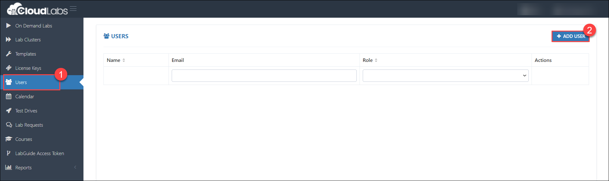
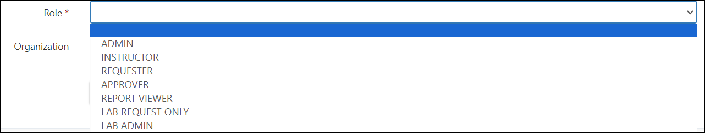
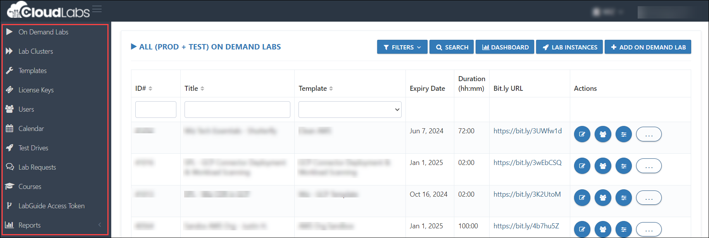
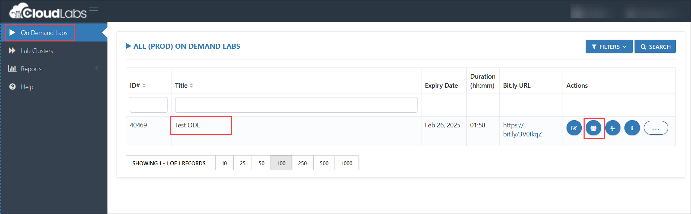
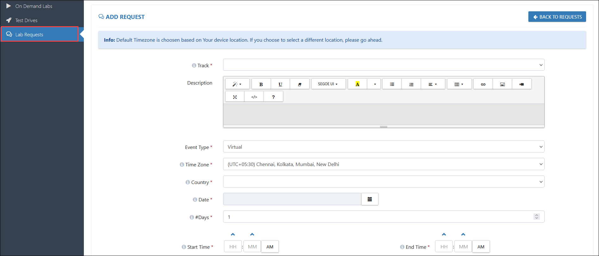
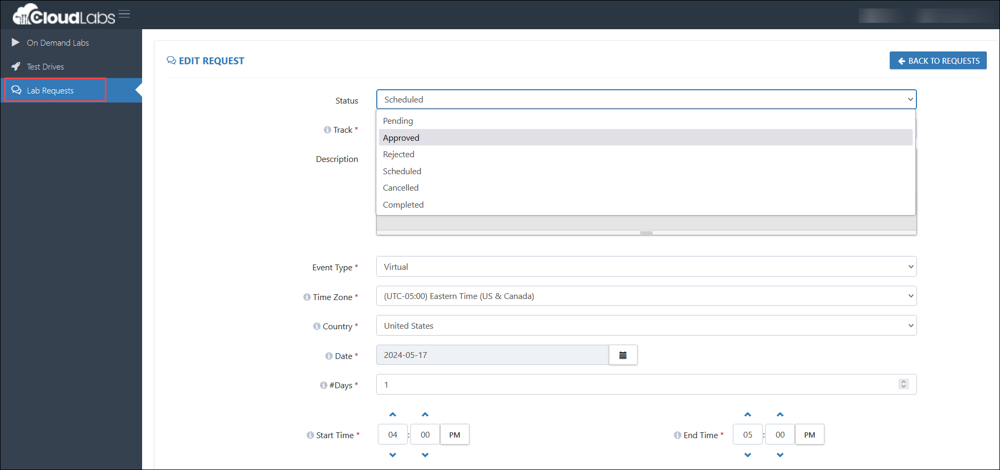

# Tenant User Permissions  

1. Admin access to [CloudLabs Admin Portal](https://admin.cloudlabs.ai/) (If access is unavailable, kindly reach out to your point of contact or [CloudLabs Support](https://docs.cloudlabs.ai/RequestSupport)).

2. Navigate to the necessary Tenant and select the **users (1)** section. Next, click on the **+ Add User (2)** option.

   

3. After clicking on **+ Add User,** the available roles for users in CloudLabs are as follows:

   

**Admin:** Admin have full control over the CloudLabs portal, including tasks such as creating and managing templates, ODLs, and enabling user access.

 
**Instructor:** Instructor can only access and manage labs they are associated with. With instructor access, they can manage users and resources, including adding, deleting, resetting users' environments, extending lab durations, and accessing environments to start or stop resources.

 
**Requestors:** For lab requests, requestor can only submit requests. They cannot view or access other portal features such as templates or ODLs.

 - Track - The Lab for which the request is raised. 

 - Time Zone  - TIme Zone of the event. 

 - Country - Country Where the event is hosted. 

 - Date - Start date of the event.

 - #Days - Number of days the event will span. 
 
 - Start Date - Time at which lab environments should be ready. 

 - City - City where the event is hosted.

 - Notes - Anything specific that should be taken care while setting up the lab environment. 

 - Expected Attendee Count  - The number of lab environments to be pre-deployed. 

 - Supported Language - Language that will be used in the registration and lab environment page.

 - Primary Contact - Email address that can be used for communication, if there is any question regarding the lab request. 

 - Customer - Company or Organization name. 

 - Workshop Purpose - The Pupose of the Workshop. 
 
 - Duration (in Minutes) - Duration for which the lab environment will run. 

**Approver:** They can only approve lab requests and cannot access other options such as templates or ODLs.

 
**Report viewer:** Can only access and view reports like - Cost reports / users reports (PowerBI reports) and can not view / access other options. 
 
>**Note:** **Lab request only** and **Lab Admin** functionalities are still in the testing phase.  
