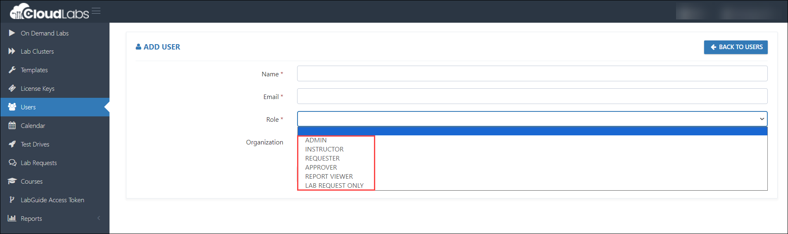

# Tenant User Permissions  

1. Admin access to [CloudLabs Admin Portal](https://admin.cloudlabs.ai/) (If access is unavailable, kindly reach out to your point of contact or [CloudLabs Support](https://docs.cloudlabs.ai/RequestSupport)).

2. Navigate to the necessary Tenant and select the **users (1)** section. Next, click on the **+ Add User (2)** option.

   

3. After clicking on **+ Add User,** the available roles for users in CloudLabs are as follows:

   

**Admin:** Admins can manage end to end CloudLabs portal.

For example: Create and manage  templates, ODLs, enabling access for users. (manage full portal)

 
**Instructor:** Instructors can only access and manage the labs they are associated to. They do not get access to all the labs but only for the labs they are supposed to instruct / teach. 

With instructor access, they can manage the users and resources (add / delete / reset users' environment / extend lab duration) and  - access environment and manage like stop or start the resources.

 
**Requestors:** This is for the lab requests, requestors can only submit the lab requests. They can not view / access other portal features like templates or ODLs.

 
**Approver:** Can only approve the lab requests. (can not access other options like template, ODLs) 

 
**Report viewer:** Can only access and view reports like - Cost reports / users reports (PowerBI reports) and can not view / access other options. 
 
 
